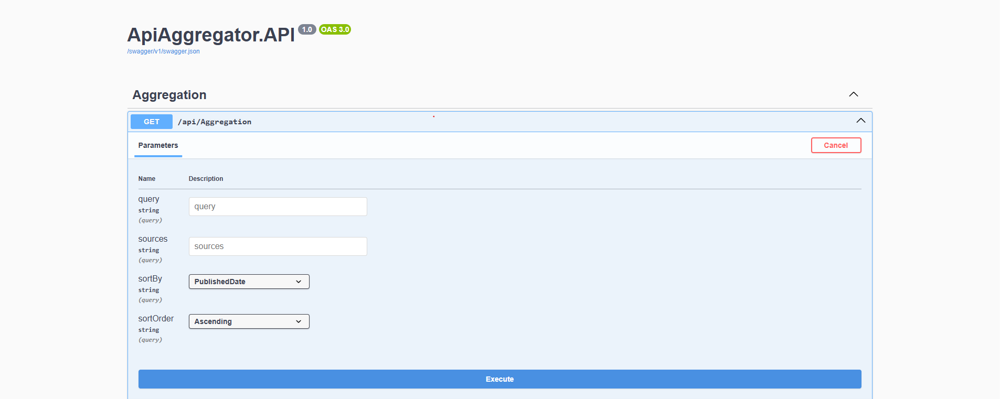

# ApiAggregator

This project implements a scalable and efficient API aggregation service that consolidates data from multiple external sources (News, Weather, GitHub) into a single, unified endpoint.

The application is built using .NET 8 and ASP.NET Core, following Clean Architecture principles to ensure high maintainability and easy integration of new data sources.

## Core Features

-   **Multi-Source Aggregation:** Fetches data in parallel from 3 external APIs: NewsAPI, WeatherAPI.com, and the GitHub API.
-   **Unified Endpoint:** Provides a single endpoint (`GET /api/aggregation`) to access the combined data.
-   **Filtering & Sorting:** Supports filtering results by source and type-safe sorting on multiple fields (`date`, `title`, `source`) and in multiple orders (`asc`, `desc`).
-   **Error Handling:** Implements a fallback mechanism where a failure from one external API does not affect the results from others. Errors are logged for debugging.
-   **API Security:** The public endpoint is protected from abuse using ASP.NET Core's built-in rate limiting (20 requests per minute).
-   **Performance Optimized:**
    -   **Parallelism:** All external API calls are made concurrently using `Task.WhenAll` to minimize response time.
    -   **Caching:** Successful aggregation results are cached in-memory for 5 minutes to provide near-instantaneous responses for repeated queries and to reduce load on external APIs.
-   **Testing:** The core service logic, including caching and error handling, is validated with unit tests using xUnit and Moq.

## Architecture

The solution is structured using **Clean Architecture** to promote a separation of concerns, testability, and maintainability.

-   **`Domain`:** Contains the core business models (e.g., `AggregatedData`) and enums. It has no dependencies.
-   **`Application`:** Contains the core application logic and service interfaces (e.g., `IAggregationService`). It orchestrates the business rules.
-   **`Infrastructure`:** Contains implementations for external concerns. This includes the API clients for each external source, AutoMapper profiles for data transformation, and DI modules.
-   **`API`:** The ASP.NET Core Web API project that exposes the application to the web via controllers.
-   **`DependencyInjection`:** A helper project to enable a modular approach to service registration.

The project heavily utilizes the **Strategy Pattern** for its API clients. Each client implements a common `IApiClient` interface, allowing the `AggregationService` to work with any number of clients without being coupled to their specific implementations. Adding a new API source is as simple as creating a new client class and registering it in the DI container.

## Setup and Execution

### Prerequisites

-   .NET 8 SDK
-   An IDE like Visual Studio or a code editor like VS Code.

### 1. Clone the Repository

```bash
git clone https://github.com/vkourakos/ApiAggregator.git
cd ApiAggregator
```

### 2. Configure API Keys (User Secrets)

This project uses the .NET Secret Manager to handle sensitive API keys. They are not stored in the repository. You must acquire your own free API keys to run the project.

### A) Navigate to the API project directory:

```bash
cd src/ApiAggregator.API
dotnet user-secrets init
```

### B) Set your secret keys (get these from the respective API provider websites):

```bash
dotnet user-secrets set "ApiSettings:NewsApi:ApiKey" "YOUR_NEWSAPI_KEY_HERE"
dotnet user-secrets set "ApiSettings:WeatherApi:ApiKey" "YOUR_WEATHERAPI_KEY_HERE"
```

### 3. Run the Application

You can run the project from the root directory of the solution or directly from Visual Studio by setting the ApiAggregator.API project as the startup project.

```bash
dotnet run --project src/ApiAggregator.API
```

---

## API Documentation

This section details the service's endpoint, including its parameters and response formats.

### `GET /api/aggregation`

Retrieves, aggregates, and sorts data from all configured sources based on a single query.

#### Parameters

| Parameter   | Type   | Description                                                                                                                              | Required | Default         |
|-------------|--------|------------------------------------------------------------------------------------------------------------------------------------------|----------|-----------------|
| `query`     | string | The search term. It is used as a keyword for News, a city for Weather, and a username for GitHub.                                       | Yes      | N/A             |
| `sources`   | string | A comma-separated list of sources to include (e.g., `GitHub,NewsAPI`). If omitted, all sources are returned.                               | No       | `null` (all)    |
| `sortBy`    | string | The field to sort the results by. Valid options are `date`, `title`, `source`.                                                           | No       | `date`          |
| `sortOrder` | string | The order for sorting. Valid options are `asc`, `desc`.                                                                                  | No       | `desc`          |

#### Example Requests

```http
GET https://localhost:7291/api/Aggregation?query=Athens
GET https://localhost:7291/api/Aggregation?query=Athens&sources=Github&sortBy=Title&sortOrder=Ascending
```

#### Example Response
```http
[
  {
    "sourceApi": "WeatherAPI.com",
    "title": "Weather in Athens, Greece",
    "content": "Currently 34°C (Sunny). Feels like 32,5°C. Wind is 28,1 kph from the NNE.",
    "url": "https://www.weatherapi.com/",
    "publishedDate": "2025-07-03T13:05:09Z"
  },
  {
    "sourceApi": "NewsAPI",
    "title": "Greece battles wildfire near capital as summer’s first heatwave hits",
    "content": "Coastal blaze triggers evacuation orders, days after state of emergency declared over fires on Aegean island of Chios.",
    "url": "https://www.aljazeera.com/news/2025/6/26/greece-battles-wildfire-near-capital-as-summers-first-heatwave-hits",
    "publishedDate": "2025-06-26T16:36:07Z"
  },
  {
    "sourceApi": "GitHub",
    "title": "Athens/rb",
    "content": "Athens Ruby Meetups",
    "url": "https://github.com/Athens/rb",
    "publishedDate": "2012-03-19T13:16:36Z"
  }
]
```

#### Swagger UI
The API includes interactive documentation via Swagger / OpenAPI for easy testing and exploration.

